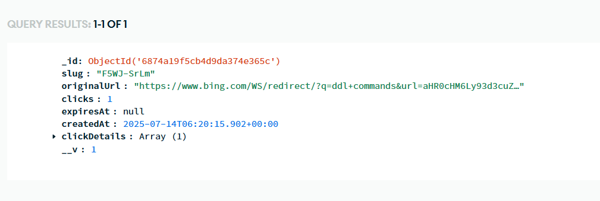
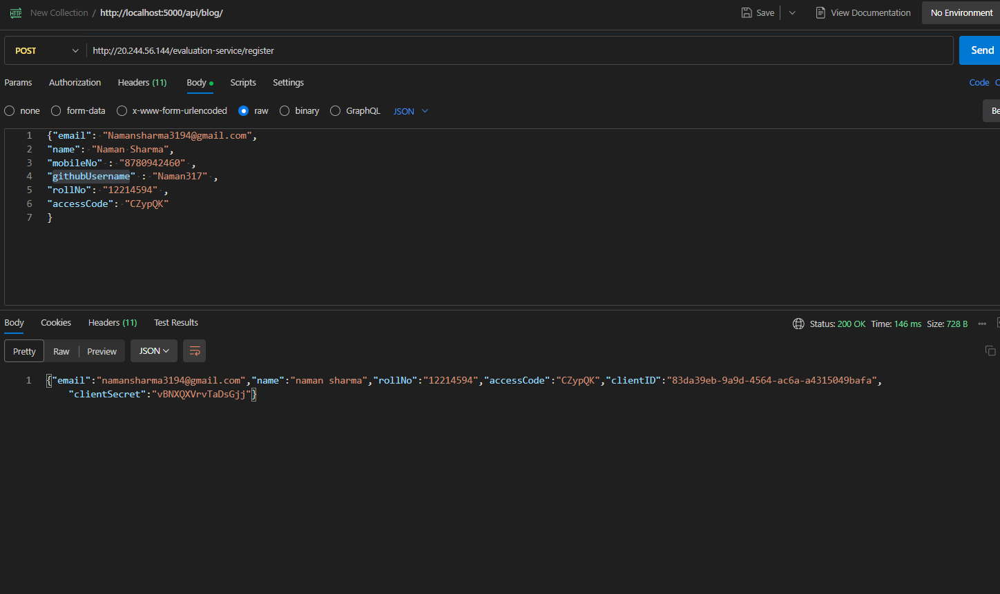
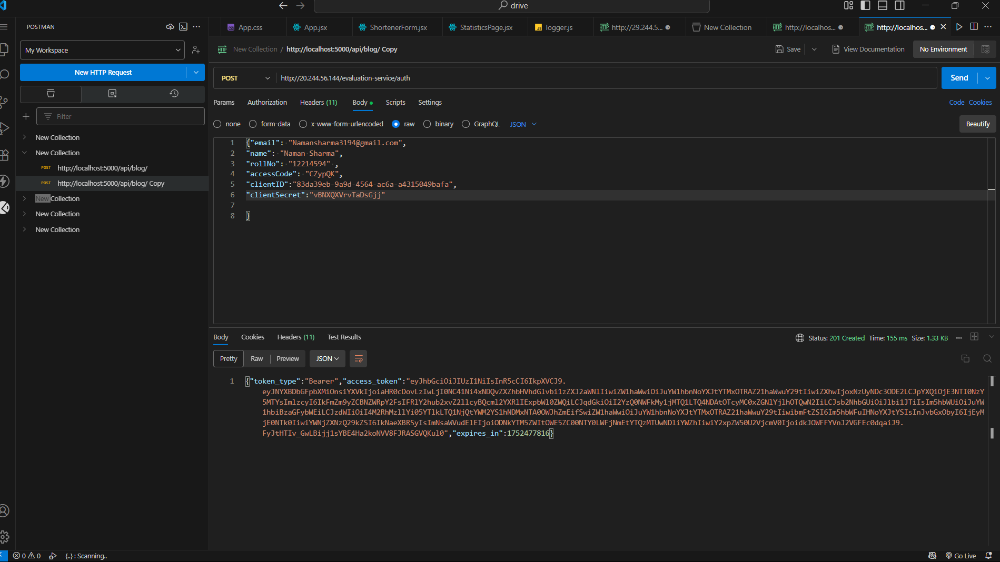
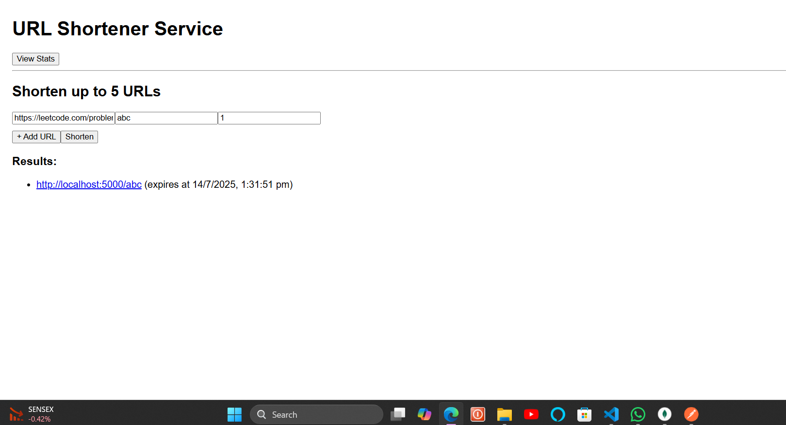

---

## Features

- URL shortening with random or custom slugs
- MongoDB-based persistent URL storage
- Logging middleware with API integration
- Frontend form to create and view short URLs
- Redirect support for shortened URLs
- Clean separation of backend, frontend, and shared middleware

---

## Technologies Used

- Node.js, Express.js
- MongoDB with Mongoose
- React.js
- Axios for HTTP requests
- Environment variables using dotenv

---

## Setup Instructions

### 1. Clone the Repository
### 2. Create a .env file in the backend-test-submission directory:
PORT=5000  
MONGO_URI=your-mongodb-connection-string  
AUTH_TOKEN=your-log-api-token

## 3.Install Dependencies  
### Backend
cd backend-test-submission  
npm install  
### Frontend
cd ../frontend-test-submission  
npm install

## Logging Middleware
The shared logger.js middleware is used to send structured logs to:  
http://20.244.56.144/evaluation-service/logs

---
## Screenshot

---

---

----

---

